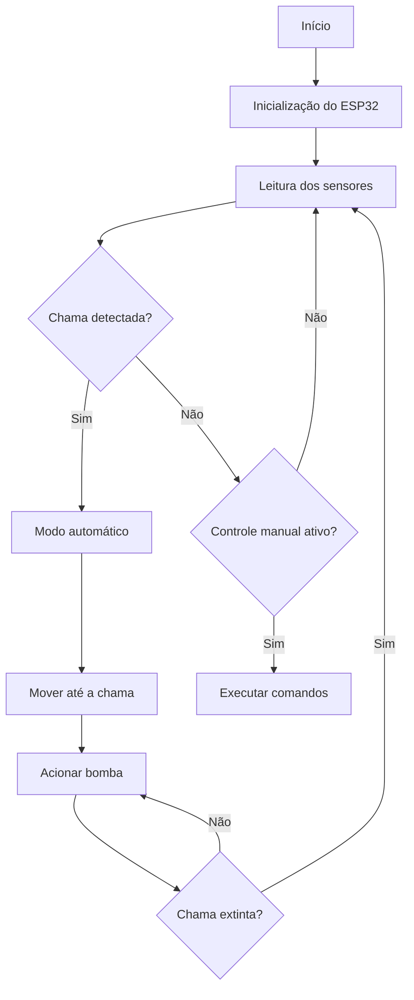

  

# 🔥 FireVision

Repositório do trabalho da disciplina de **Projeto Integrado de Computação I (PIC I)**  
Curso de **Engenharia de Computação – Universidade Federal do Espírito Santo (UFES)**

---

## 👨‍💻 Trabalho desenvolvido por

- Daniel Silva Braz  
- João Vitor Coimbra Silva  
- Thiago Messias Martinelli  

---

## 📑 Sumário

- [Resumo](#resumo)
- [Introdução](#introdução)
- [Embasamento Teórico](#embasamento-teórico)
- [Materiais e Metodologia](#materiais-e-metodologia)
- [Estratégia de Codificação](#estratégia-de-codificação)
- [Resultados e Discussão](#resultados-e-discussão)
- [Fluxogramas e Diagramas Técnicos](#fluxogramas-e-diagramas-técnicos)
- [Conclusão](#conclusão)

---

## Resumo

Os incêndios representam uma das principais ameaças à segurança humana e ambiental, especialmente em áreas urbanas e florestais. Nesse contexto, este projeto apresenta o desenvolvimento do **FireVision**, um robô móvel inteligente voltado ao combate inicial a incêndios em pequena escala.

O sistema é capaz de se locomover em ambientes internos, detectar focos de fogo por meio de sensores de chama, extinguir automaticamente o incêndio utilizando um sistema de bombeamento de água e operar de forma remota por meio de um aplicativo móvel. O projeto busca reduzir riscos à vida humana, otimizar o tempo de resposta em emergências e promover o uso da robótica e automação como ferramentas de apoio à segurança pública e ambiental.

**Palavras-chave:** Robótica móvel; Combate a incêndios; Automação; Sistemas embarcados; IoT.

---

## Introdução

Incêndios são responsáveis por grandes prejuízos sociais, econômicos e ambientais, além de representarem um risco direto à vida humana. No Brasil, episódios recorrentes de queimadas e incêndios estruturais evidenciam a necessidade de soluções tecnológicas capazes de auxiliar no combate rápido e seguro dessas ocorrências.

Tradicionalmente, o combate a incêndios depende fortemente da atuação humana, expondo bombeiros e equipes de resgate a ambientes extremamente perigosos. Diante desse cenário, o uso de robôs móveis surge como uma alternativa viável para atuar em situações de risco, especialmente em estágios iniciais do incêndio.

O projeto **FireVision** tem como objetivo desenvolver um robô inteligente capaz de detectar focos de incêndio, extingui-los automaticamente e permitir controle remoto, reduzindo a exposição humana ao perigo.

---

## Embasamento Teórico

### Robótica Móvel

A robótica móvel estuda sistemas robóticos capazes de se locomover de forma autônoma ou semiautônoma em diferentes ambientes, utilizando sensores, atuadores e unidades de processamento para navegação, controle e tomada de decisão.

### Sensores de Incêndio

Sensores de chama operam a partir da detecção de radiação infravermelha emitida pelo fogo, sendo amplamente utilizados em sistemas de detecção precoce devido à sua rapidez e baixo custo.

### Internet das Coisas (IoT)

A Internet das Coisas possibilita a comunicação entre dispositivos físicos por meio de redes sem fio. No FireVision, essa tecnologia permite o controle remoto do robô por meio de um aplicativo móvel.

---

## Materiais e Metodologia

### Materiais Utilizados

- ESP32 (Wi-Fi e Bluetooth);
- Sensores de chama (3 unidades);
- Motores DC (4 unidades);
- Ponte H L298N;
- Bomba d’água com relé;
- Servomotor;
- Estrutura mecânica com rodas;
- Bateria Li-ion 7,4 V – 3200 mAh;
- Cabos e resistores.

### Metodologia

O desenvolvimento do projeto seguiu as seguintes etapas:

1. Definição dos requisitos do sistema;
2. Seleção e testes dos componentes eletrônicos;
3. Montagem da estrutura mecânica;
4. Integração do sistema eletrônico;
5. Programação do microcontrolador;
6. Implementação da comunicação com o aplicativo móvel;
7. Testes em ambiente controlado.

---

## Estratégia de Codificação

A estratégia de codificação foi baseada em uma arquitetura modular, priorizando:

- Uso de **PWM** para controle de velocidade dos motores;
- Utilização da função `millis()` em substituição à função `delay()`, evitando bloqueios na execução;
- Prioridade do **modo automático**, responsável pela detecção e combate ao fogo;
- Ativação do modo manual apenas na ausência de detecção de chamas.

---

## Resultados e Discussão

Os testes realizados demonstraram que o robô é capaz de se locomover adequadamente pelo ambiente, detectar focos de incêndio e acionar automaticamente o sistema de extinção por meio da bomba d’água. O controle manual mostrou-se eficiente em situações nas quais não havia detecção de chamas.

Entretanto, foram observadas limitações relacionadas à autonomia energética e à sensibilidade dos sensores sob iluminação intensa, indicando a necessidade de melhorias futuras.

---

## Fluxogramas e Diagramas Técnicos

### Fluxograma Geral de Funcionamento

---

## Conclusão

O projeto **FireVision** demonstrou ser uma proposta inovadora para o combate inicial a incêndios em pequena escala. A integração entre robótica móvel, sensores e sistemas embarcados possibilitou o desenvolvimento de um robô funcional, capaz de operar de forma autônoma ou manual, reduzindo a exposição humana a ambientes perigosos.

Como trabalhos futuros, sugere-se o aprimoramento da autonomia energética, a inclusão de novos sensores e a ampliação dos testes em ambientes mais complexos, visando aumentar a robustez e a confiabilidade do sistema.
